## July 31/2023

I started writing a game using Pulp - https://play.date/pulp/39818/edit/

I downloaded and installed the Playdate SDK. I had to search for it to discover it was installed in my Developer folder on my Mac.

brandonflowers > Developer > PlaydateSDK

The Playdate SDK comes with a simulator which is found within the the bin folder.

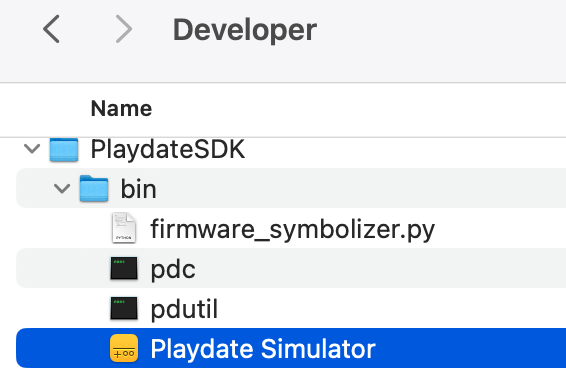

[love framework for lua](https://love2d.org/)

I thought about using [VS Code](https://devblog.cadinbatrack.com/2021/09/28/developing-for-playdate-in-vscode/) but I think I'll try [Nova](https://nova.app/) which seems to have a lot of support for Lua and makes it easy to run the Playdate Simulator.

https://extensions.panic.com/extensions/com.panic/com.panic.Playdate/

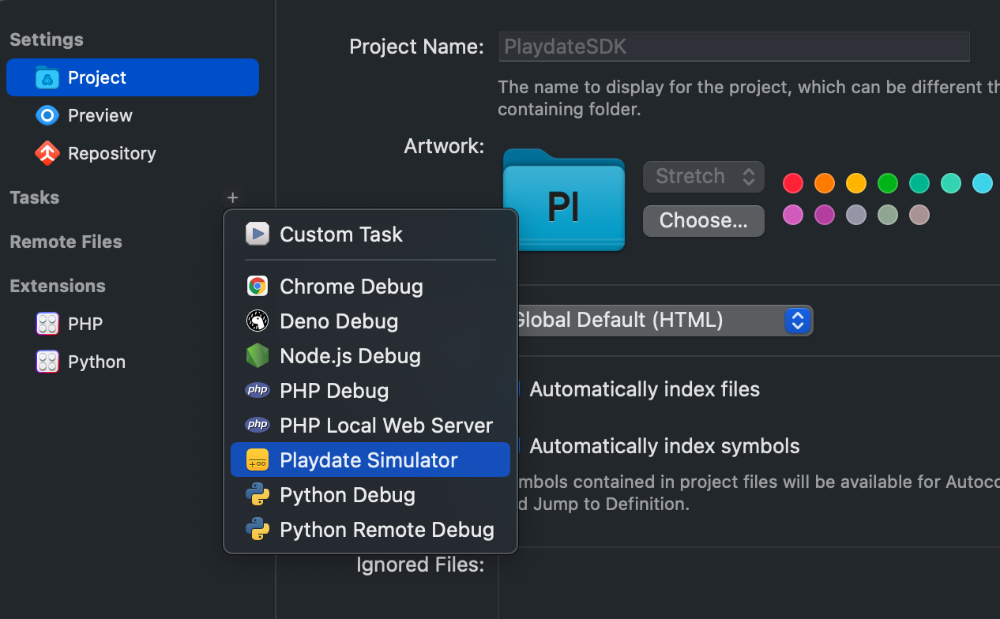

By running the Playdate date in Nova, I was able to compile each of the examples game and run them in the simulator.

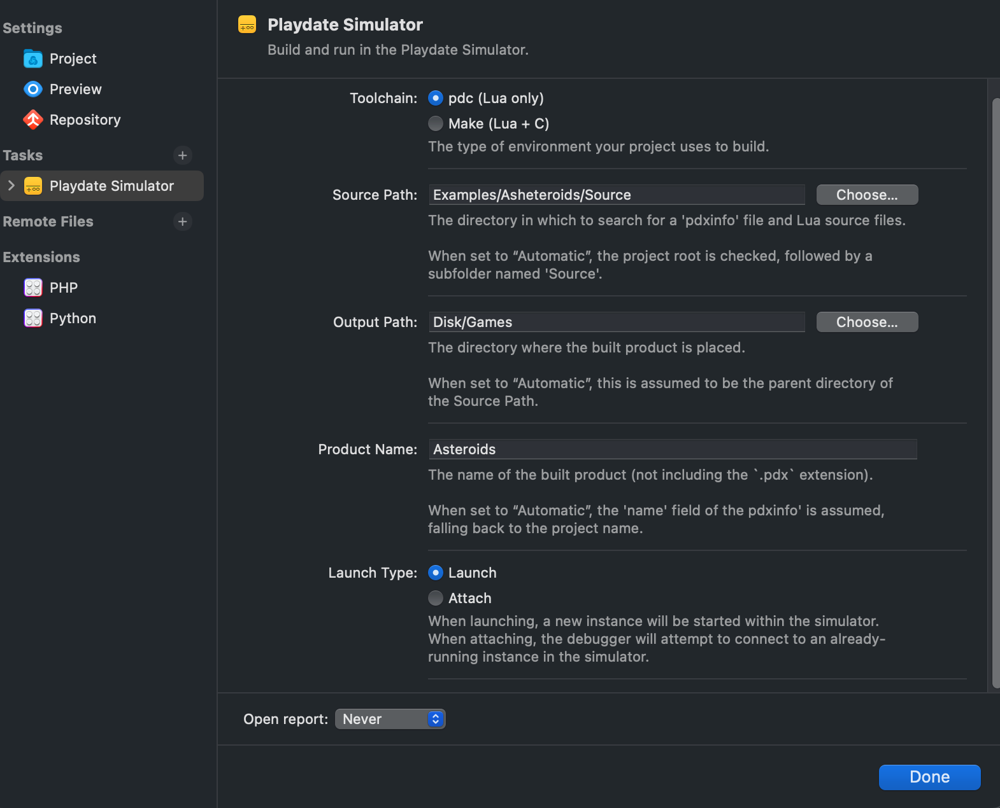

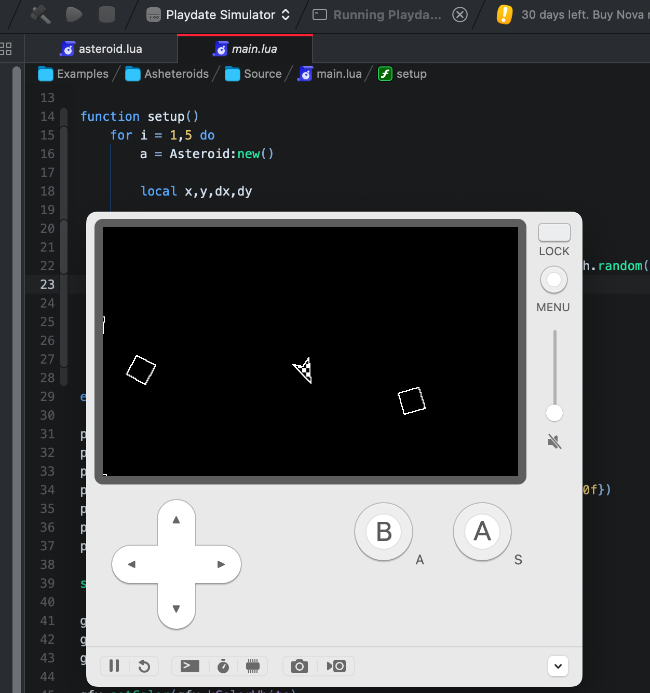

[panels](https://devblog.cadinbatrack.com/2022/03/02/panels-for-playdate/)

## August 1/2023

[pulp to lua converter](https://devforum.play.date/t/pulp-mill-a-pulp-to-lua-converter/4581)

[lua: Inspecting a basic game for Playdate](https://dev.to/rmion/inspecting-a-basic-game-for-playdate-c50)

#### Top Playdate Games

no order just games I find inspiring and like their aesthetic

- [herbtales](https://ficuno.itch.io/herbtales)
- [conquest of helios](https://jongjungbu.itch.io/conquest-of-helios)
- [sprout](https://rngpartygames.itch.io/sprout)
- [the simorgh](https://haddock86.itch.io/the-simorgh)
- [the lushes land](https://sn-studios.itch.io/the-lushes-land)
- [pulpmon](https://brothersvr.itch.io/pulpmon)
- [the botanist](https://cadinb.itch.io/the-botanist)
- [quest for the x](https://intellikat.itch.io/quest-for-the-x)
- [pulpcraft](https://squidgod.itch.io/pulpcraft)

## August 2/2023

It's time to came up with a few game ideas. As time is limited and I want to release something, I'm going to try and keep the scope small and take inspiration from the 72 hr game jams but spend that time over the course of a few months.

I started game design google doc which will be easier to share with others and keep track of ideas.

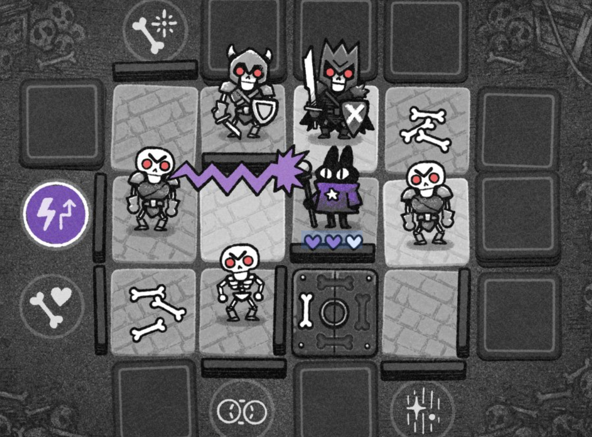

I've pitched and convinced my collaborator on working within a tile-based world after showing him this excellent example [crypt-of-the-bone-king](https://tinytouchtales.itch.io/crypt-of-the-bone-king) of what can be accomplished during a [7DRL Challenge](https://7drl.com/)

## August 20/2023

We decided not to pursue a space opera and de-scoped the game play from a X-Com-like turn-based combat to a choose-your-own-adventure style game. So this means I get to explore writing [tree structures in lua with some help from chatgpt](https://www.perplexity.ai/search/deddcd3e-bcec-4251-94cc-63401a393d6c?s=c).

## August 23/2023

I have 8 days to decide to purchase Nova or not. It looks like it possible to use the [console to compile](https://betterprogramming.pub/how-to-build-a-game-for-the-playdate-console-using-the-playdate-sdk-and-lua-cc8fd2079433) and run the game. I'm enjoying Nova so far though and at $100 it's not a huge investment; still VS Code is free and has co-polit!

## September 1/2023

My Nova trial has expired and want to take one last at building wih VS Code so am exploring the playdate forum for help.
I did like all the profiling and ease of use with Playdate; really felt in the flow while developing. At $99, I'm going to time-box this VS Code to a couple hours and if I can't get it working, I'll purchase Nova. My time is more valuable as is making and potentially selling something!

If I can make a fraction of this [reported revenue](https://squidgod.dev/#revenue), I'll recoup my dev costs and experinece the ectasy of making something people enjoy; or hate; at least feel something. It's fascinating to see how SquidGod engages with his community on [itch](https://squidgod.itch.io/).

While not exactly related to VS CODE, [this ecosystem post](https://devforum.play.date/t/i-made-a-project-template-toolset-for-folks-familiar-with-the-javascript-ecosystem/10574) by a fellow JS dev is interesting to build playdate projects with familiar tools.

WOW!!!

So the author of that post, [colingourlay](https://github.com/colingourlay) created a [Metroivania](https://github.com/colingourlay/playdate-metroidvania) repo to test his builder which I have just cloned and ran using npm start! And presto - the game built and is now running on the simulator. This may be the perfect work-around. If I can write in VS Code, and it will watch the files, and update the app, this is excellent workflow for me.

The ideal workflow and feedback loop would be an instant, and this is more like a few seconds, but it's still decent. The simular screen will go white, and sometimes pause and then I just need to click on it to get it to run again; not having to click occasionally would obviously be better.

I played around updating the gravity variable to make jumping easier. Super inspiring!

## September 2/2023

In effort to spend as little money as I can on tools, it seems best to avoid my desired hand-drawn aesthetic for now and lean into pixel art. @pateon recommended [aseprite](https://www.aseprite.org/) which is $20.

I'm going through tile and dither brush tutorials - [MortMort](https://www.youtube.com/watch?v=cLESnHw2dPE) is excellent.

Mac tip - when they say Control B - it's actually Command B - spent way too long trying to figure that out.

Along with pixel art, for the Playdate it's also a matter of embracing 1 bit! Black and white only; one needs to apply dithering to create the illusion of shading.

- https://www.youtube.com/watch?v=cLESnHw2dPE
- https://surma.dev/things/ditherpunk/
- https://blog.adafruit.com/2021/06/09/ditherpaint-a-1-bit-browser-based-drawing-application/
- https://ditherit.com/
- https://dev.to/bytebodger/dithering-images-with-reactjavascript-och
- https://devforum.play.date/t/playdither-a-web-tool-for-1-bit-image-dithering/5339

I'm going to try to use my mouse but will most likey grab a [$40 wacom tablet](https://www.bestbuy.com/site/wacom-intuos-graphic-drawing-tablet-for-mac-pc-chromebook-android-small-with-software-included-black/6196636.p?skuId=6196636) or possibly this [Huion](https://www.amazon.ca/HUION-420-Battery-Free-Compatible-Chromebook/dp/B00DTPYWBG) since I shouldn't need a sophisticated one for pixel art. I used to have Wacom tablet back in the hazy days of Flash.

## September 8/2023

The playdate-metroidvania repo uses LDTK so that encouraged me to grab a copy from [ldtk.io](https://ldtk.io/) and decided to pay $10 based on my current funds which is nice to being the options. I could have paid nothing. I can also donate more if I provided value and if I ever make money from my game.

I have opened the world.ldtk file in LDTK and am attempting to add more screens to it. I discovered that right-clicking a tile will delete while left-clciking will add a tile.

I've now extended the original 3 screen world and added another 10 screens and was able to quickly draw these screens using the tile brush.

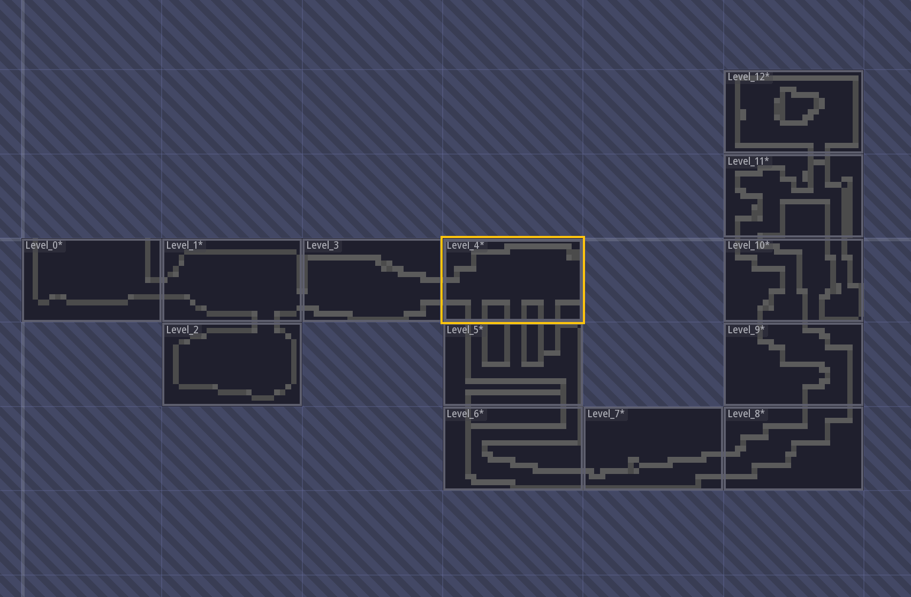

## September 30/2023

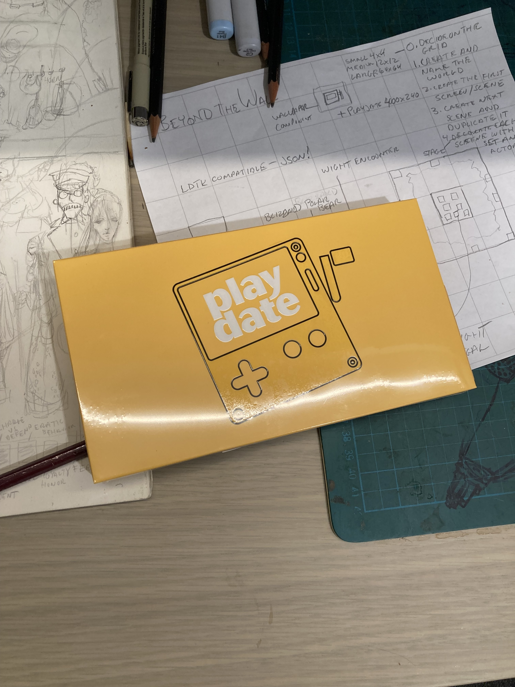

My Playdate arrived! At first I was a bit worried it had bricked since it took nearly 2 hours to charge!

I played the few games and purchased Resonant Tale since it was described as being Zelda-like.

We need to be careful with such comparison to Link Awakenings. I had to lean on this [walkthrough](https://www.youtube.com/watch?v=L6NlQ5CsJH8) to progress and I also found it easier to play via the [mirror](https://play.date/mirror/) on my large monitor.

The screen is small and suffers from no backlight.

## October 4/2023

Today, I'm going to try and get the game running on the actual device instead the simulator.

[how can I test my Playdate game on the actual Playdate device not the simulator?](https://www.perplexity.ai/search/how-can-I-c_mnR32URH.93yiTB5P2jA?s=c)

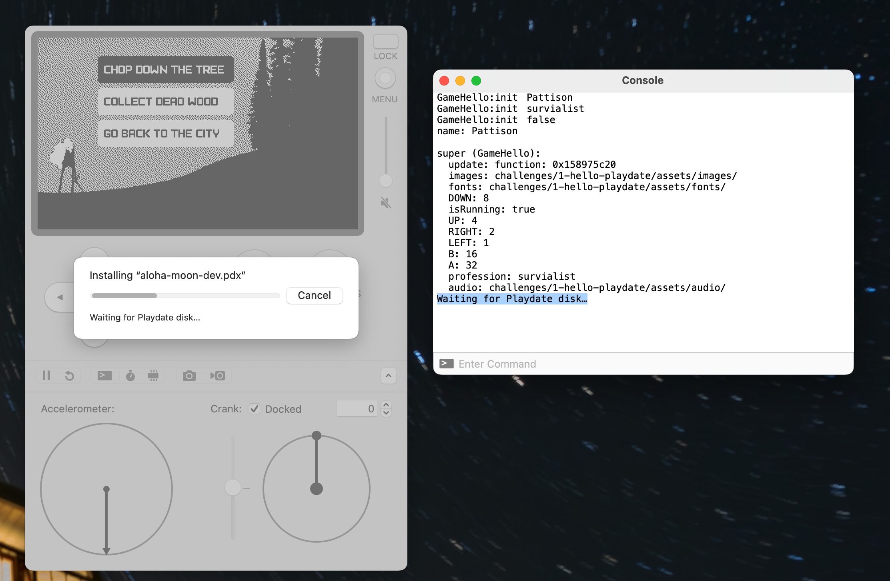

I had mirror running so I believe was blocking my connection to the simulator. Once I kill mirror, it start to print device info to the console.

So I'm not able to load my game onto the device. It does look like its connected because the playdate icon appears on the simulator and I can see text in the console in blue text.

I can take screenshot of the device and it appears in my desktop folder. I can use the device to control the simulator!

Only Updload to Device doesn't seem to work. `Waiting for Playdate disk…` appears in the console, and nothing happens.

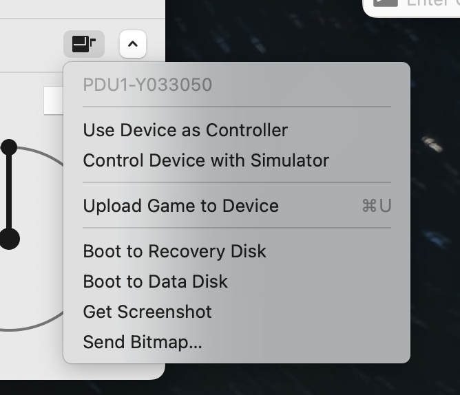

a search for `waiting for disk` on the [dev forum](https://devforum.play.date/search?q=waiting%20for%20disk) reveals a few posts with similar issues.

After reading through the post, one dev mentioned command-d to also show the device info.

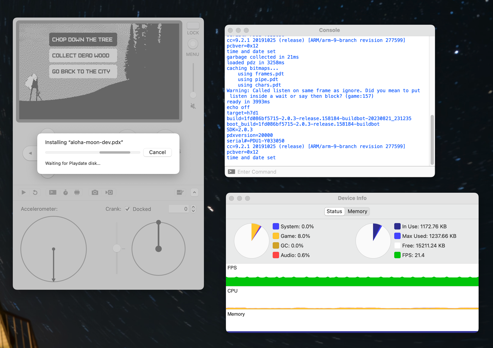

I tried a different open source project and it had the same result.

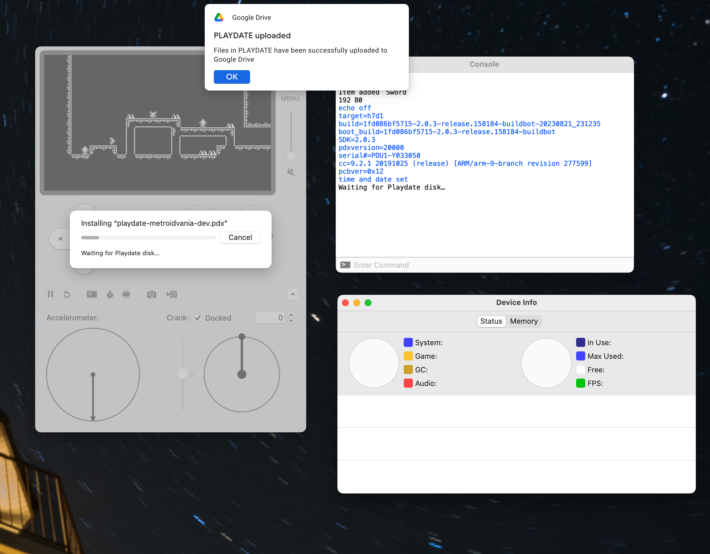

With the device info open, now I got the `Successfully uploaded` message but I still see the Waiting for Playdate disk… message.

Next, I tried the side load method and that worked! I simply had to zip the single pdx file and then drag it onto the Sideloaded page on my Playdate Account.

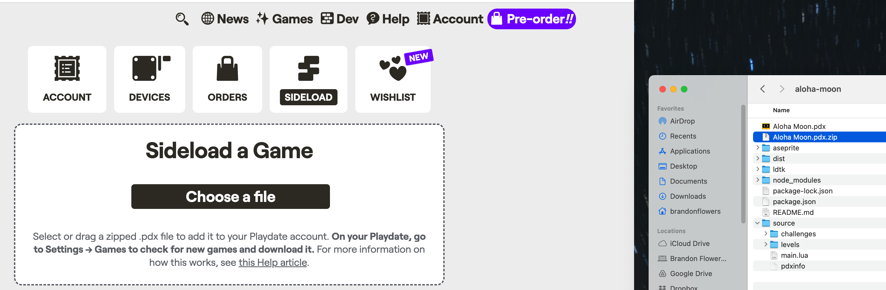

I dragged the zip file onto the page and it uploaded.

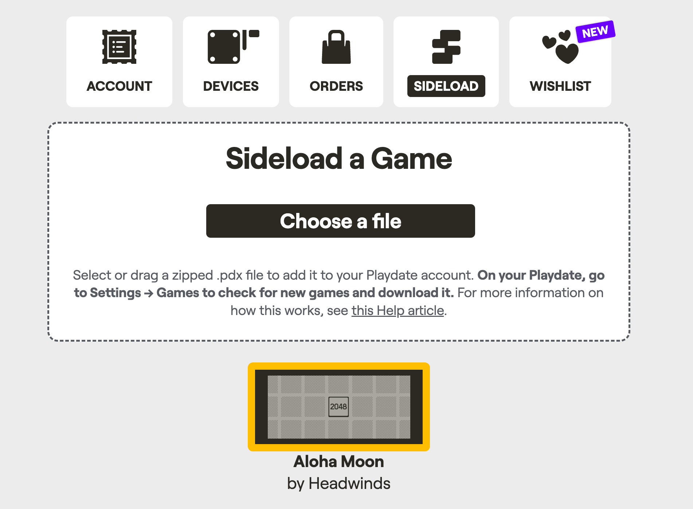

After that I downloaded the game from the Playdate Game > Settings section, and was able to install it.

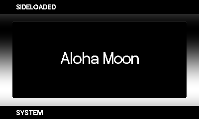
