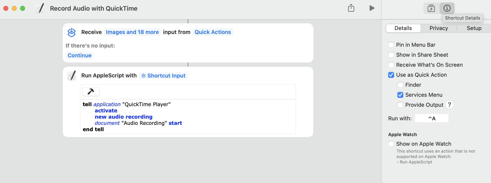

# Record Meeting Audio with QuickTime

I wanted the ability to secretly meetings (semi secretly! more like quietly) with key stakeholders so I could review their feedback and instructions later on.

If you ever have a boss say "I don't you that already..." and missed some important detail, this is for you!

Also if you're wondering if this [is legal](https://www.google.com/search?q=is+illegal+to+secretly+record+audio+for+personal+review&rlz=1C5GCCM_en&oq=is+illegal+to+secretly+record+audio+for+personal+review&gs_lcrp=EgZjaHJvbWUyBggAEEUYOdIBCTE0NzM0ajBqMagCALACAA&sourceid=chrome&ie=UTF-8), it is! But read that article and be very careful! I would only recommend it for note taking and even tell your boss once that from time to time you may record the conversation as they should see it as a productivity boost! By capturing key information, it should only help you create the best work.

When I join a meeting now with my manager, I can simply ctrl-A to start recording the audio if I hear important details without interrupting the flow.

